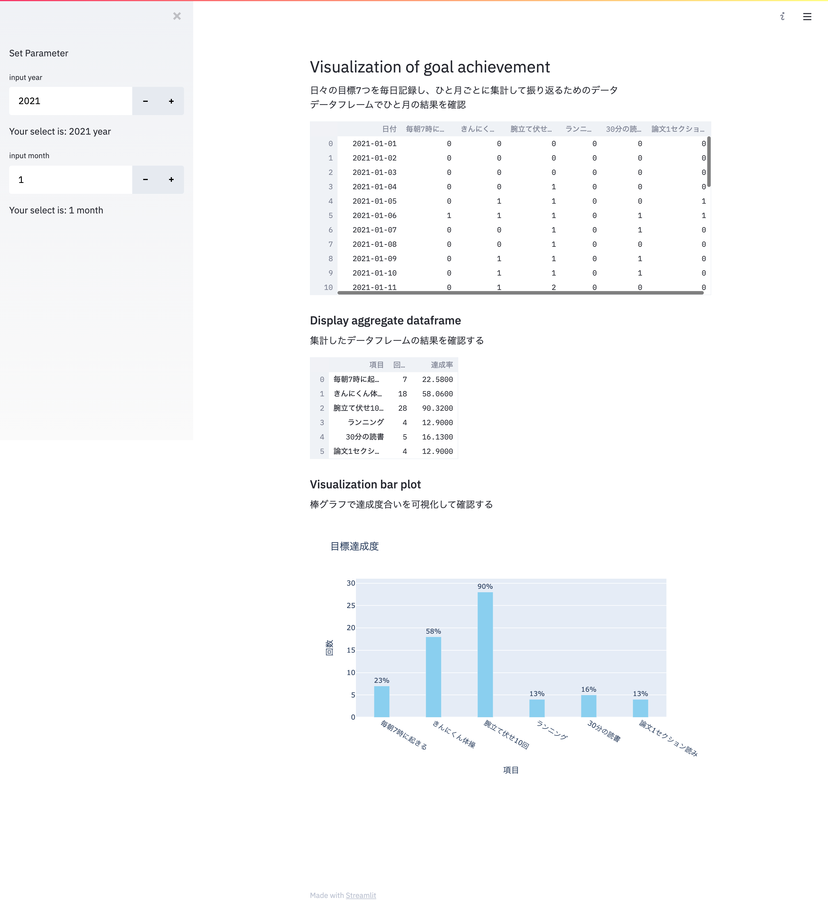

# Streamlitを使ってデータを可視化
目標（習慣）振り返り記事のためにメモしたログを可視化する方法として、せっかくなのでStreamlitを使っています

## 前処理
リズムケアのアプリからDLできるcsvから必要な情報のみを抽出するために、前処理を行います
```python
# サンプルコード
python preprocess.py -i ../data/202101/RhythmCareData_202101.csv

> RhythmCareData_202101_preprocess.csv
```
出力として、前処理済みのcsvデータが保存されます

## Streamlit起動
Streamlitを立ち上げるために以下のコードを実行して、`http://localhost:8501`にアクセスするとプロトタイプ画面が確認できます
```python
streamlit run streamlit_main.py
```
## 画面イメージ
サンプルで作成したイメージを載せておきます

